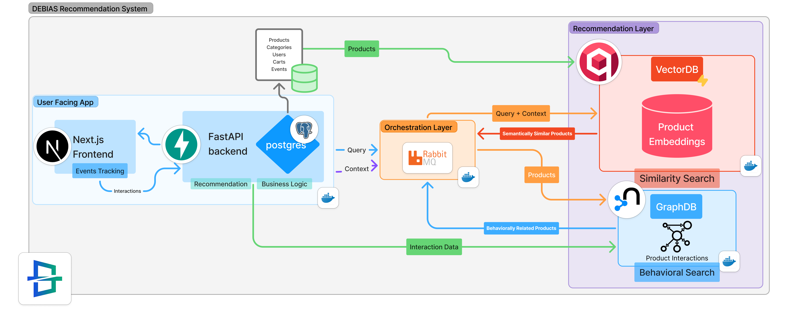

<p align="center">
  
</p>

<p align="center">
  <span style="font-size:1.5em;">
    Debiased E-Commerce Search with Budget-Aware Intelligence
  </span>
</p>

<p align="center">
  
  
  
  
</p>

> **DEBIAS a recommender system that also doubles as a consumer-centric platform for digital commerce.**  
> It combines semantic understanding, budget awareness, and debiased learning to ensure users discover products that are *relevant, affordable, and fair* and *also popular*.

---

## 🌍 Motivation

Traditional e-commerce recommendation systems suffer from **relevance saturation bias**:

- Users stop searching once an acceptable item appears
- Early-ranked and higher-priced products dominate exposure
- Models can learn position and popularity bias instead of true relevance

This leads to suppressed relevance, poor discovery, and diminished user trust.

### ⚡ Our Solution

DEBIAS rethinks product discovery by embedding **economic intelligence and fairness constraints** directly into the retrieval and ranking pipeline.

---

## 🧠 How DEBIAS Works

DEBIAS introduces a **three-layer intelligence stack**:

| Layer | Description |
|------|------------|
| 🔍 **Semantic Intent Layer** | Understands what users mean, not just what they type |
| 🪐 **Interactive Search Layer** | Interprets and outputs searches relatively to semantic vector spaces |
| ⚖ **Debiased Ranking Layer** | Corrects exposure and position bias using DualIPW |

This ensures that affordable, high-value products are not unfairly under-ranked.

---

## 🏛️ System Architecture

DEBIAS is designed as a **modular, scalable, and consumer-first platform** that integrates real-time interaction tracking, semantic retrieval, and behavioral reasoning.

<p align="center">
  
</p>

---

## 🧩 Architecture Breakdown

### 🖥️ Consumer-Centric User Interface

- **Next.js Frontend**
  - Fast, responsive, and intuitive shopping experience
  - Tracks granular user interactions (search, click, view, cart)
  - Designed to leverage **vector embedding properties** for discovery

> 🎯 **UI Innovation:**  
> The interface engages the user to surface *semantically related alternatives* in the vector **space** 🔭, enabling users to explore conceptually similar products they may not have explicitly searched for.

---

### ⚙️ Backend & Data Layer

- **FastAPI Backend**
  - Central entry point for recommendation and search requests
  - Applies business logic, constraints, and ranking rules
- **PostgreSQL**
  - Stores products, categories, users, carts, and interaction events
  - Provides structured data for debiasing and analytics

---

### 🧠 Orchestration Layer

- **Query + Context Assembly**
  - Combines user intent, session context, and historical behavior
- **RabbitMQ**
  - Asynchronous orchestration of recommendation workflows
  - Ensures scalability and fault tolerance
- **Dockerized Services**
  - Independent components for flexible deployment and scaling

---

### 🔍 Recommendation Layer

#### 🧬 Semantic Retrieval (VectorDB)

- Stores dense **product embeddings**
- Performs similarity search based on semantic intent
- Enables:
  - Concept-based discovery
  - Budget-aware alternatives
  - Multimodal search extensions

#### 🕸️ Behavioral Retrieval (GraphDB)

- Models user–product interactions as a graph
- Identifies behaviorally related and cold-start products
- Discovers under-exposed but high-connectivity items

---

## ⚡ End-to-End Recommendation Flow

1. User interacts with the UI
2. Events are tracked and persisted
3. Query and context are embedded
4. **Qdrant** retrieves semantically similar products within budget constrictions
5. **Neo4j** enriches results with behavioral signals
6. Debiasing logic corrects exposure effects
7. Final ranking emphasizes **relevance, affordability, and fairness**

---

## 🛠️ Technology Stack

<p align="center">
  
  
  
  
  
  
  
  
</p>


---

## 🚀 How to Run

### Prerequisites

- **Docker** and **Docker Compose** installed
- **Node.js** v18+ (for frontend development)
- **Python 3.10** (if running backend locally without Docker)

### Quick Start with Docker Compose

1. **Clone the repository**

   ```bash
   git clone https://github.com/your-org/DEBIAS.git
   cd DEBIAS
   ```

2. **Configure environment variables**

   ```bash
   cp Ecommerce-API/.env.example Ecommerce-API/.env
   ```

3. **Start all services**

   ```bash
   docker compose up --build
   ```

   This launches:
   | Service | URL | Description |
   |---------|-----|-------------|
   | FastAPI Backend | http://localhost:8000 | API & Swagger docs at `/docs` |
   | PostgreSQL | http://localhost:5432 | Relational database |
   | Qdrant | http://localhost:6333 | Vector database for semantic search |
   | Neo4j | http://localhost:7474 | Graph database for behavioral retrieval |

4. **Apply database migrations**

   ```bash
   docker compose exec app python migrate.py
   ```

5. **Start the frontend**

   ```bash
   cd "Ecommerce Frontend"
   pnpm install
   pnpm dev
   ```

   Frontend available at: http://localhost:3000

6. **Stop all services**

   ```bash
   docker compose down
   ```

### Demo Credentials

| Persona | Username | Password | Description |
|---------|----------|----------|-------------|
| 🧵 **Sewing Suzie** | `suzie` | `iloveSewing` | An avid sewing lover |
| 🧹 **Vacuum Vincent** | `vincent` | `cleanFreak` | A clean freak with an affinity for vacuums |
| 💻 **Laptop Larry** | `larry` | `obsessedLarry` | Larry just loves to browse laptops, and we love Larry |
| 🔧 **Admin** | `admin` | `admin` | System administrator |

---

## 🌱 Impact & Vision

DEBIAS enables:

- 💸 Fair access to all accessible and relevant products
- 🧭 Discovery beyond popularity bias
- 🧠 Intent-aware exploration
- 🔎 Trustworthy, transparent recommendations


***We're very happy to step closer towards consumer-first AI for digital marketplaces.***

---

## 👨‍💻 Team

- **Youssef Abid**
- **Ala Eddine Zaouali**
- **Noursine Amira**
- **Adem Saidi**
- **Younes Abbes**